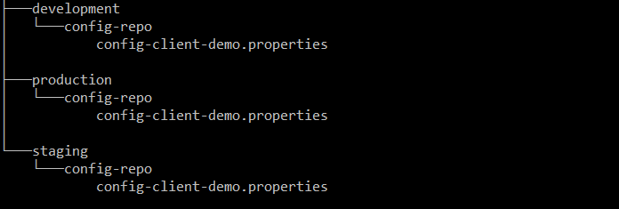
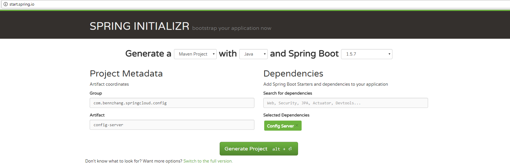
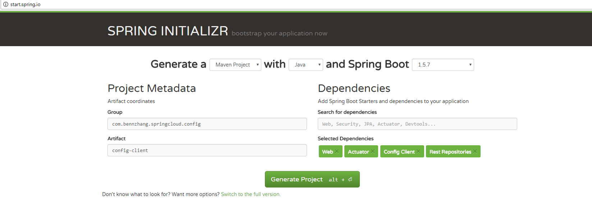

# spring-cloud-config-demo

# 1 CONFIG-REPO
Create git repos for configurations. Configurations are either properties or yaml files. Names are like below. 

```
/{application}/{profile}[/{label}] 
/{application}-{profile}.yml
/{label}/{application}-{profile}.yml
/{application}-{profile}.properties
/{label}/{application}-{profile}.properties
```

Setup properties repos are mainly based on two ways, `one repo per application` or `one repo per profile`.  This demo uses `one repo per profile` strategy. Create the strcutre like below in your local repositories. 



go to each folder `development`, `staging` and `production`,  run following
```
git init
git add .
git commit -m "add properties file"
```

The properties files are extremely simple, having only one property `example.message`

```
$ cat development/config-repo/config-client-demo.properties
example.message=This is a dev properties

$ cat staging/config-repo/config-client-demo.properties
example.message=This is a staging properties

$ cat production/config-repo/config-client-demo.properties
example.message=This is a production properties
```

In the example, three local git repositories are created.  One is `development` repository, one is `staging` repository, the last is `production` repository. Based on different profile, different properties will be used. 

# 2 CONFIG-SERVER
Create project using [SPRING INITIALIZR](http://start.spring.io/)



## 2.1 EnableConfigServer

Simplely add `EnableConfigServer` annotation in the main spring boot class. 
```
@SpringBootApplication
@EnableConfigServer
public class ConfigServerApplication {

    public static void main(String[] args) {
        SpringApplication.run(ConfigServerApplication.class, args);
    }
}
```

## 2.2 application.yml
We are using  `one repo per profile` in the example. Below is the `application.yml`. For demo purpose, local repositories are used. For the real config-repos, change to `uri` to real `gitserver` repositories location.

```
server:
    port: 8888

# spring cloud config repo settings.
spring:
  cloud:
    config:
      server:
        git:
          uri: https://gitserver/development/config-repo # default repo
          repos:
            development:
              pattern: 
                - '*/development'
                - '*/qa'
              uri: C:\\Users\\bzhang\\git-repo\\development\\config-repo
            staging:
              pattern: 
                - '*/staging'
              uri: C:\\Users\\bzhang\\git-repo\\staging\\config-repo
            production:
              pattern: 
                - '*/production'
              uri: C:\\Users\\bzhang\\git-repo\\production\\config-repo
            local:
              pattern:
                - '*/local'
              uri: C:\\Users\\bzhang\\git-repo\\development\\config-repo

#Disable security of the Management endpoint
management:
  security:
     enabled: false
```

From the `application.yml` above, you can see there are three repositories for different profiles. `development` and `qa` are using the same `development` repository, the `staging` and `production` profile has its own repository. Each repository could have its own security controls. 


Except `one repo per profile`, you can also define your `application.yml` like below to demonstrate `one repo per application`:

```
spring:
  cloud:
    config:
      server:
        git:
          uri: https://gitserver/config-repos/{application}
```


## 2.3 Force pull in Git repository 

set `spring.cloud.config.server.git.force-pull=true`

Spring Cloud Config Server by default makes a clone of the remote git repository and if the local copy gets dirty it cannot update the local copy from remote repository.  To solve this problem, there is a `force-pull` property that will make Spring Cloud Config Server force pull from remote repository if the local copy is dirty.
```
spring:
  cloud:
    config:
      server:
        git:
          uri: https://github.com/production/config-repo
          force-pull: true
```

If you have a multiple repositories configuration you can configure the force-pull property per repository. 

## 2.4 Push Notifictions.

Normally, many source code repository providers (like Github) will notify you of changes in a repository through a webhook. You can configure the webhook via the provider’s user interface as a URL and a set of events in which you are interested. For instance Github will POST to the webhook with a JSON body containing a list of commits, and a header "X-Github-Event" equal to "push". If you add a dependency on the `spring-cloud-config-monitor` library and activate the Spring Cloud Bus : `spring-cloud-starter-bus-amqp` or `spring-cloud-starter-bus-kafka` or `spring-cloud-starter-bus-redis`. in your Config Server, then a "/monitor" endpoint is enabled. 

```
  <dependency>
    <groupId>org.springframework.cloud</groupId>
    <artifactId>spring-cloud-config-monitor</artifactId>
  </dependency>
  <dependency>
    <groupId>org.springframework.cloud</groupId>
    <artifactId>spring-cloud-starter-bus-redis</artifactId>
    <!-- or -amqp (rabbitmq) or -kafka -->
  </dependency>
```

## 2.5 Start and Test config-server
```
mvn clean install
java -jar target/config-server-0.0.1-SNAPSHOT.jar
```
Open browser and test those.
```
http://localhost:8888/config-client-demo/development
http://localhost:8888/config-client-demo/staging
http://localhost:8888/config-client-demo/production
```

# 3 CONFIG-CLIENT
Create project using [SPRING INITIALIZR](http://start.spring.io/)



## 3.1 bootstrap.properties
In client side, you needs to create bootstrap.properties. The bootstrap.properties allows the application connect spring cloud config server first and pulls all properties of this application when it starts. It is defined like this.

```
$ cat bootstrap.properties
server.port=8001
spring.application.name=config-client-demo
spring.profiles.active=development

spring.cloud.config.uri=http://localhost:8888
management.security.enabled=true
```

The yaml format is below, they are identical. Either one is fine. 

```
$ cat bootstrap.yml
server:
  port: 8001

spring: 
  application:
    name: config-client-demo

spring:
  profiles:
    active: development

spring:
  cloud: 
    config:
      uri: http://localhost:8888

management:
  security:
    enabled: true
```

The application name has to match as the {application} in the git repositories.

## 3.2 Start and Test config-client-demo
Compile: 
```
# compile
mvn clean install

# start config-client-demo application with the development profile
java -jar config-client-demo.jar --spring.application.profiles=development

# Test application use another console
curl http://localhost:8001/message
```
You should get something like this: 
```
This is a dev properties
```

Try other profiles:`staging` and `production`: 

```
# start config-client-demo application with staging profiles
java -jar config-client-demo.jar --spring.application.profiles=staging

# start config-client-demo application with production profiles
java -jar config-client-demo.jar --spring.application.profiles=production
```

`curl http://localhost:8001/message` you will get for staging and production


## 3.3 Actuator Enable Refresh Config 

### 3.3.1 Add Actuator dependency

```
    <dependency>
      <groupId>org.springframework.boot</groupId>
      <artifactId>spring-boot-starter-actuator</artifactId>
    </dependency>
```

### 3.3.2 Add @RefreshScope Annotation
```
@RestController
@RefreshScope
public class MessageController {
    @Value("${example.message}")
    private String msg;

    @RequestMapping("/message")
    String getMsg() {
        return this.msg;
    }
}
```

When configations change on the config-server, you can trigger `/refresh` endpoint manually to reload the config changes.


 # 4 Auto Refresh Config

 From above, you need to trigger `/refresh` endpoint manually to reload the config changes. This is not practical and viable if you have large number of applications. `Spring Cloud Bus` module can be used to implement auto refresh configs. It links multiple applications with a message broker and broadcast configuration changes.

 (Continue .. )

  